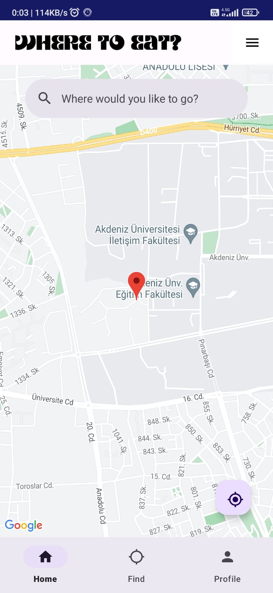
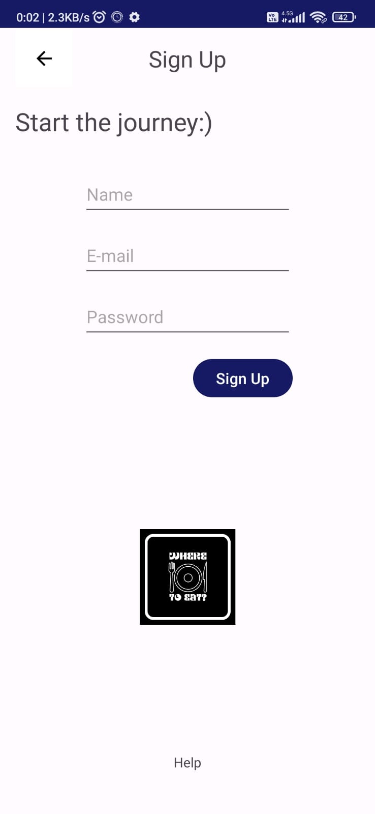
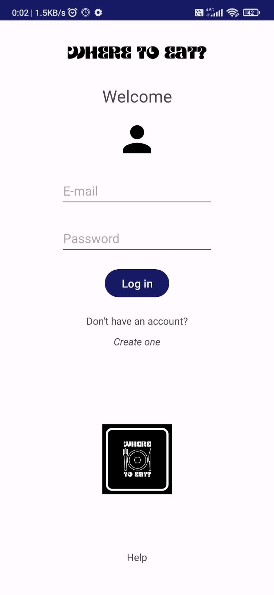

# Restaurant Finder App

## Overview
The Restaurant Finder App is a mobile application designed to help users discover nearby restaurants, view their rankings, and manage their profiles. It leverages the Google Maps APIs for location-based services and integrates Firebase for user authentication. The app is built using Kotlin programming language and developed in Android Studio.

## Features

- **Nearby Restaurant Search:** Users can search for nearby restaurants based on their current location.
- **Restaurant Rankings:** Users can view the rankings of restaurants, helping them make informed dining choices.
- **Profile Management:** Users can manage their profiles within the app, including updating personal information and preferences.
- **Firebase Authentication:** The app integrates Firebase Authentication for secure user login and registration processes.

## Prerequisites

Before running this application, make sure you have the following:

- Android Studio installed on your development machine.
- Kotlin plugin installed in Android Studio.
- A Google Cloud Platform account to access the Google Maps APIs.
- Firebase account for authentication services.

## Getting Started

### Setting up Google Maps API Key

1. Obtain a Google Maps API Key from the [Google Cloud Platform Console](https://console.cloud.google.com/).
2. Enable the necessary APIs, including the Maps SDK for Android.
3. Add your API Key to the `google_maps_api.xml` file in the `res/values` directory of your project.

### Setting up Firebase Authentication

1. Create a new Firebase project on the [Firebase Console](https://console.firebase.google.com/).
2. Add your Android app to the Firebase project by following the setup instructions provided.
3. Download the `google-services.json` file and add it to your project's `app` directory in Android Studio.
4. Follow the Firebase documentation to set up authentication methods such as email/password, Google sign-in, etc.

## Running the Application

1. Clone this repository to your local machine.
2. Open the project in Android Studio.
3. Build the project by clicking on the "Run" button or pressing `Shift + F10`.
4. Choose an emulator or connect your Android device to run the application.

## Usage

- **Search for Nearby Restaurants:** Use the search feature to discover restaurants near your current location.
- **View Restaurant Rankings:** Explore the rankings of restaurants to make informed dining decisions.
- **Manage Profile:** Access the profile section to update personal information and preferences.
- **Authenticate:** Use Firebase authentication to securely log in and register within the app.

## Screenshots

## Contributing

Contributions are welcome! If you have suggestions for improving the app or want to add new features, please fork the repository and submit a pull request.

## License

This project is licensed under the MIT License - see the [LICENSE](LICENSE) file for details.

## Acknowledgments

- This app utilizes the Google Maps APIs for location services.
- Firebase Authentication is used for user authentication and management.
